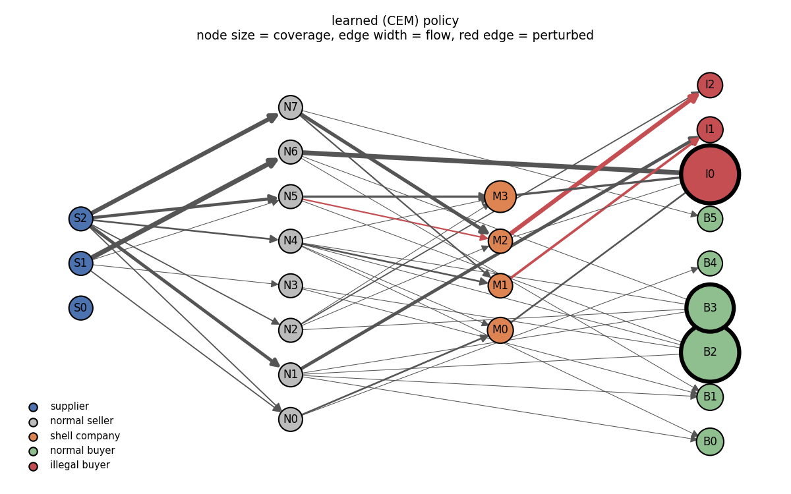
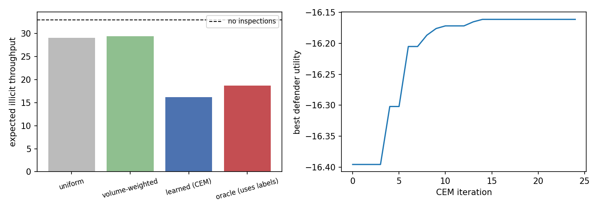

# Graph-Based Stackelberg Model for Adversarial Supply Chain Enforcement

This repository implements the model in *Graph-Based Stackelberg Model for Adversarial Supply Chain Enforcement* ([paper](LINK_TO_PAPER)). An enforcement agency commits to a randomized node-inspection policy on a directed supply-chain graph, and a smuggling network then perturbs edge capacities within a budget and routes chips from suppliers to illegal buyers along whatever paths remain most profitable.



In the figure above, node size shows inspection probability and edge width shows the smuggler's optimal flow. The learned policy concentrates coverage on the illegal buyer I0, so the smuggler spends its perturbation budget on the shell-company edges that lead to I1 and I2, which are marked in red.

## How the model maps to code

| Paper | Code |
|---|---|
| Graph G = (V, E, X, W, Y), Section 2 | `stackelberg/graph.py` |
| Leader policy and coverage, eqs. (1) to (3) | `stackelberg/leader.py` |
| Attack set, flows, follower utility, eqs. (4) to (9), (11) | `stackelberg/follower.py` |
| Defender utility and equilibrium, eqs. (10), (12) | `stackelberg/game.py` |

The follower's best response is computed exactly. For a fixed coverage vector, the perturbed capacities W + δ enter the flow constraints linearly, so the inner max-flow and the outer choice of δ combine into one linear program, which `best_response` solves with HiGHS. The leader's problem has no useful gradient through that program, so `cem_search` approximates θ* with the cross-entropy method over a linear softmax policy π_θ = softmax(Xθ).

Node features are in-degree, out-degree and weighted degree, and the role labels are left out by default. A defender who could read the labels would simply inspect the known shells and illegal buyers, which is what the `oracle` baseline does as a reference.

## Running it

```bash
pip install -r requirements.txt
python -m pytest tests
python experiments/run_experiment.py --graph toy --inspections 1
python experiments/run_experiment.py --graph random --inspections 3
python experiments/run_experiment.py --graph random --inspections 3 --mode realized
```

Each run prints a comparison table and writes figures and a `results.json` file to `results/`.



## Two evaluation modes

The paper describes two timings. In `expected` mode the smuggler best-responds to the marginal coverage c(v), following eqs. (8) to (10). In `realized` mode the smuggler sees each sampled inspection set before routing, every inspected node (shell company or illegal buyer) carries no flow, and the results are averaged over sampled sets, which matches the text of Section 2.1.

These modes lead to different optimal policies. Eq. (8) discounts flow only at illegal buyers, so in `expected` mode inspecting a shell company does not change the smuggler's payoff, and the best policy puts all of its coverage on illegal buyers.

## Implementation choices not fixed by the paper

Flow is bounded by the perturbed capacity, f ≤ W + δ. Flow may not leave an illegal buyer or enter a supplier. The attackable edge set Ẽ contains every edge with a shell company at either end. Normal buyers conserve flow, as eq. (5) specifies, so they cannot absorb illicit throughput.

## Limitations

The graphs are small and synthetic, and the cross-entropy search is a simple baseline rather than a scalable solver. Section 4 of the paper discusses the modelling limitations. Natural next steps are a graph neural network policy and a repeated game over a distribution of graphs.
